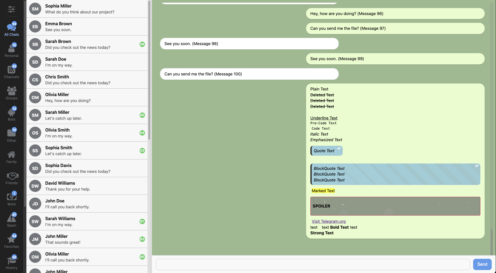
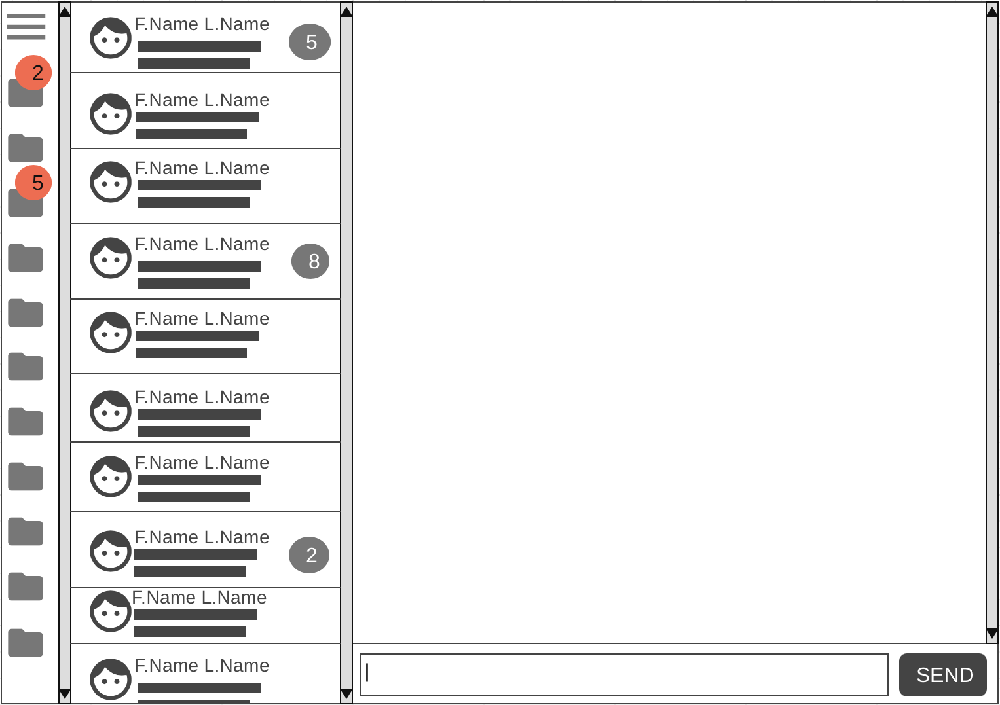
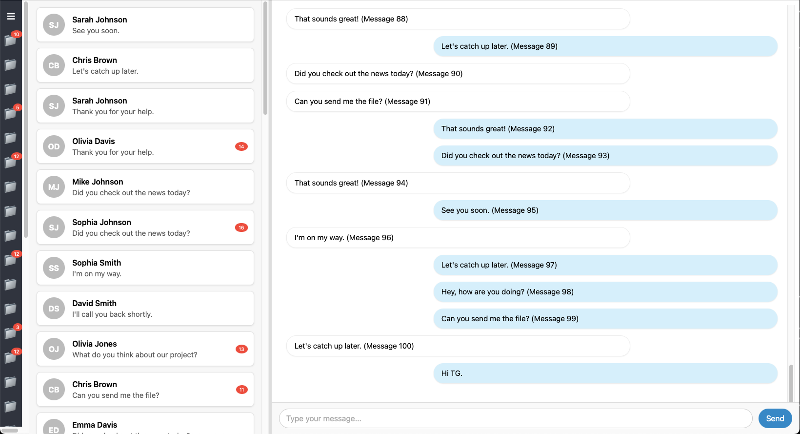

# Telegram Contest (JavaScript Developers, Round 1, 2025)

---

### This section is for version 0.1.0 descriptions, for version 0.2.0 descriptions, go to the bottom of the readme file.

---

#### <ins>PREFACE:</ins>

I have completed all the tasks, including the bonus task, and I have added two additional features as well.
However, I followed a different approach for executing this project and the tasks, which I will explain in detail in the text below.
I kindly ask you to read the entire text thoroughly, as I put in a lot of effort to ensure everything is correct.
Thank you very much.

---

I previously participated in a competition related to designing a website for `TonKeeper Battery`, which aimed to introduce and establish the concept of `Battery`.
For this competition, I designed a website aligned with the Battery concept, which you can view here ([TK-Battery-Concept](https://beingal.github.io/TK-Battery-Concept/ "TK-Battery-Concept")).
Although I was not among the top three finalists, my project was included in the honorable mentions list.

This time, I was determined to achieve first place.
To that end, I used two remaining days of my monthly work leave and coordinated with my workplace to secure an additional day off, giving me a total of three days to dedicate entirely to this project.
My weekends are reserved for family time and cannot be allocated to other activities.

Instead of forking the main project and working on it directly, I created a foundational project and implemented tasks on it for several reasons:

1. Due to time constraints, I couldn’t allocate enough time to familiarize myself with the existing project to ensure compatibility between my code and other components.  
2. After reviewing the current text editor in the project, I noticed several issues. Given my prior experience in developing `Rich Text Editors`, I decided to create an editor from scratch that does not have those issues and problems.

To ensure seamless integration of my work into the current project or any other project you may have in mind, I took several steps so that you can easily copy and paste my code into any project by simply providing an element.
The code will function correctly:  

  * All components are written using pure JavaScript and CSS without any third-party libraries.  
  * The code is compatible with Chrome, Firefox, and Safari browsers, with exceptions for each handled individually.  
  * The JavaScript and CSS files for each component and task are separated and stored independently within their respective directories.

---

<p align="center">
  
</p>

---

#### <ins>DEMO:</ins>

In addition to submitting the project as an archive file and through the bot, I will make it publicly available at this address after the project deadline:

  * [Source Code (GitHub)](https://github.com/BeingAl/TC_JS_R1_2025/ "GitHub")
  * [Demo (App) (v0.1.0)](https://beingal.github.io/TC_JS_R1_2025/index_v0.1.0.html "Demo (App) (v0.1.0)")
  * [Demo (App) (v0.2.0)](https://beingal.github.io/TC_JS_R1_2025/index.html "Demo (App) (v0.2.0)")
  * [Demo (Animated Background)](https://beingal.github.io/TC_JS_R1_2025/components/animated_background/ "Animated Background")

---

#### <ins>DIR_TREE:</ins>

```sh
.
├── components
│   ├── animated_background
│   │   ├── astronaut_cats.svg
│   │   ├── index.html
│   │   ├── script.js
│   │   └── styles.css
│   ├── chat_box
│   │   ├── script.js
│   │   └── style.css
│   ├── chat_list
│   │   ├── script.js
│   │   └── style.css
│   ├── editor_v0.1.0
│   │   ├── script.js
│   │   └── style.css
│   ├── editor_v0.2.0
│   │   ├── ast.js
│   │   ├── editor.js
│   │   ├── history.js
│   │   ├── index.html
│   │   └── style.css
│   ├── folder
│   │   ├── script.js
│   │   └── style.css
│   └── scrollbar
│       └── scrollbar.css
├── fonts
│   └── icons
│       └── fontawesome
│           └── v6.7.2-web
│               └── *
├── images
│   ├── quote.svg
│   ├── samples
│   │   ├── ui_basic(skeleton).png
│   │   ├── ui_final.png
│   │   └── wireframe.png
│   └── spoiler.svg
├── index_v0.1.0.html
├── index.html
├── LICENSE
├── README.md
├── script.js
└── style.css
```

---

#### <ins>WARM_UP:</ins>

The most challenging task in this competition was related to the text editor.
However, I usually start a project by completing some smaller tasks as a warm-up, which helps me gradually become familiar with the project and get used to it before tackling the more difficult tasks. 

For this reason, I first created a wireframe of what I wanted to build, and then based on that, I designed an initial appearance or skeleton.
After that, I proceeded to work on the folder tasks and the animated background, each of which I will explain separately later.

<div style="display: flex; justify-content: space-around;">
    
    
</div>

---

#### <ins>FOLDERS:</ins>

The folders did not present any particular challenges and are visible in the program demo.
I generate the badges on the folders randomly, so their position and numbers change with each page refresh.

Additionally, for this part, I chose not to use separate icon files because I did not find it suitable for this section.
Instead, I converted a set of icons I needed into an `icon font` using the website [Fontello](https://fontello.com "Fontello").
I found this approach more appropriate and much more convenient.
All the selected icons are from `Font Awesome`.

#### <ins>FOLDERS (Additional Feature):</ins>

There was a feature that I personally felt a strong need for, especially when using Telegram to handle business and work-related matters, dealing with a large number of people and messages daily. 
Sometimes, to `focus better`, I need to see only the unread individuals and messages in a folder when I open it, while hiding all other chats and messages.
In the project demo, you can activate this feature by `double-clicking on any folder`, and deactivate it with another double-click.

This was an idea I had previously wanted to suggest as a feature to Telegram. In this project, I had the opportunity to demonstrate it as a prototype of what I envisioned.

**UX Tips:**

If this feature is deemed acceptable and approved on your end, there are some UX-related points I would like to mention:

  * This feature could be implemented as a toggle at the top of the folder list for easier handling or kept as the double-click method I proposed.
  * If you decide to implement it using double-clicks, based on my experience with previous applications, older users often face difficulties with double-clicking. The default time frame set by OSs for recognizing two consecutive clicks as a double-click is too short for many elderly users. As a result, they may click multiple times on a folder trying to open it. To address this issue in applications I develop, I typically set the `time frame` for recognizing a `double-click` to `0.75` or `1.0` seconds. This means if someone clicks twice on a folder within this interval, it will count as a double-click. This simple adjustment significantly reduces errors for older users.
  * For mobile or tablet apps, considering that double-clicking is not intuitive for touchscreen users, you should use holding down a finger on the folder to activate this feature. Additionally: Older individuals generally have larger fingers compared to younger adults or children. They are also more likely to suffer from conditions like high blood pressure, diabetes, or other illnesses that can cause swelling in their bodies and fingers. Therefore, on touchscreens, the touch area should be made larger than usual to minimize errors for them as well.

---

#### <ins>Animated Background:</ins>

When reviewing the sample link you provided, the first approach that comes to mind is handling this with ‍Canvas‍ or ‍WebGL‍.
However, considering that lightweight performance is a priority, these options are not suitable.
I opted to use `CSS Conic Gradient` for this implementation. The reasoning is as follows and Here's how I implemented this part:

   - **WebGL:** relies on both the GPU (for rendering animations and gradients) and the CPU (for certain calculations), resulting in high resource consumption for both.
   - **Canvas (2D Context):** is entirely handled by the CPU and does not utilize the GPU, which makes it unsuitable since my primary focus was minimizing CPU usage.
   - **CSS Gradients:** on the other hand, perform most of their tasks on the GPU with minimal CPU involvement. This makes CSS gradients significantly more efficient in terms of resource consumption compared to `Canvas` or `WebGL`.

**Handling Different Screen Types**:  

By default, a CSS Conic Gradient set to 100% of the viewport size should work correctly. However, challenges arise due to varying screen types:

  - Regular screens
  - Wide screens
  - Horizontal monitors
  - Vertical monitors  

To ensure compatibility across all these scenarios and to cover the entire screen without leaving white corners:

  - Shaped the gradient into a circle using `border-radius`.
  - Set its size to `double the viewport dimensions`, ensuring full coverage regardless of screen orientation or aspect ratio.

This approach ensures optimal performance while maintaining visual consistency across various devices and screen types.

Finally, I added functionality to make the `Conic Gradient rotate CounterClockwise` with each mouse `click`.  
The result was completely identical to the WebGL version but achieved with the lowest CPU and GPU usage.

---

#### <ins>TEXT EDITOR:</ins>

Finally, the hardest, most challenging, and most interesting task of the competition.

As I explained at the beginning of the text, I built the Text Editor from scratch, and I will explain my reasons for doing so later.  
Additionally, I implemented it based on an `editable div`, which means you can easily replace your current editor entirely with this one.
You just need to add the `emoji` components and the `pop-up` elements used for text formatting to this element.

In general, a `Rich Text Editor` is a component that is extremely costly to maintain, not because it is overly complex, but because careful attention must be paid to all aspects.
Adding any new feature or functionality often causes issues in other parts of the component, which happens in most cases.  
For this reason, the best approach is to use third-party solutions or the options available in the SDK of each platform to eliminate the maintenance burden on the development team.
However, if it must be developed independently, it should be implemented in the simplest way possible to minimize maintenance costs and avoid the issue mentioned earlier—where fixing one part or adding something new creates problems elsewhere.

Previously i developed the web application with a Rich Text Editor for Samsung and LG Smart TVs running `Tizen` and `webOS`, both operating systems were significantly behind in terms of browser and web engine updates.
This resulted in limited support for modern features and numerous restrictions.
Additionally, my application had to maintain backward compatibility with older Smart TV models, which added further complexity.

When you want to create a simple Rich Text Editor for the web without using any libraries, the best and simplest approach is to use an editable element and format your text using HTML tags within it.
Then, extract the HTML inside it as an `Abstract Syntax Tree (AST)` and convert that `AST` into any format you desire.

However, there is a very common issue here: when you open an HTML tag inside an editable element and write some text within it, you cannot "escape" from that tag.
This means, for example, if you use a `<b>` tag to make the text bold, any text you write inside that editable element will continue to be bold.
Essentially, you have not exited the `<b>` tag and are still inside it.

Most people handle this issue using methods like `range` and `caret`, but in most cases, they fail to implement it correctly, and the problem persists.
This issue also exists in your current editor, if you apply a style or format to a portion of text, you cannot escape from it unless you reselect the text and remove the format.
Observing this issue was what led me to rewrite the editor entirely from scratch.

Here, the experience I previously had from developing applications for `SmartTVs` came in handy, as I had encountered this issue there as well.
I didn’t want to work with `range` and `caret` because there were compatibility issues with the operating systems, and these two methods would make the component more complex and difficult to manage.  
At that time, I used a trick where I added a `Zero Width Space`(**ZWSP**) before and after each HTML element. This was something that was not visually noticeable and did not reserve any space.
On the other hand, it was recognized as a valid character, allowing you to "escape" from the tag issue simply by using the `left` and `right` `arrow keys` to move out of the created tag.

For implementation here in modern browsers, I used the same method but made some adjustments due to the different behavior of current modern browsers compared to the browsers in SmartTVs.  
Previously, I would write a `PostProcessor Function` for my editor that would iterate through the desired editable `div` and add a `Zero Width Space (ZWS)` to the beginning and end of every HTML tag, except for the `<br>` tag and `ZWS` itself. 
However, in this case, I made some updates to this method, which I will explain further below:

1. Instead of using a plain `ZWS`, I now use a `<span>` element with its `contenteditable` attribute set to `false`, and I place the `ZWS` inside it.  
2. Previously, I would add this item both before and after the tags, but this time I noticed an issue in `Firefox`. When a `<br>` tag and a `ZWS` are placed next to each other, Firefox reserves space for them. To avoid this, I now only add the ZWS after the tags, not before them. This means that if a line starts with formatted or styled text, you cannot write anything before it, but you can write after it. If you want to start a line with plain text followed by formatted text, you can easily write your plain text on a new line and then add the formatted text afterward.  
3. In `Safari`, pressing the `Enter` key to move to the next line would create a `<div>` after the `<br>` tag and place the text inside that `<div>`, which is not the desired behavior. To address this, I prevent the default behavior of Enter for moving to a new line and instead use `Shift+Enter` for this purpose. However, Enter can still be used for sending messages, which is not an issue. (For consistency, I enabled this behavior across all browsers.)  
4. Currently, when you click at the end of a line and place the cursor there:  
   - In `Chrome` and `Safari`, by default, the cursor is positioned after the ZWS without requiring any additional action, so you can start typing right away.  
   - In `Firefox`, however, you first need to press the `right arrow key` to move past the ZWS before you can start typing.  
5. These `<span>` elements and `ZWS` are skipped when exporting content from the editor.

**Abstract Syntax Tree (AST)**: 

For this part, I wrote a function that converts the content inside the `editable div` into an `Object Array` following the `AST (Abstract Syntax Tree)` structure. (After pressing the `Send` button, I log both the HTML content and the AST structure in the `browser console`).
This AST structure allows you to convert it into any format you want.
In this project, I wrote a formatter for `Markdown` that fully converts the `AST into Markdown`, which I will explain further later.

**Markdown**: 

As I explained earlier, for this part, I wrote a function that converts the `AST to Markdown`.
The output of this is also logged in the `browser console` after pressing the `Send` button, which you can test on this website ([MarkdownLivePreview](https://markdownlivepreview.com/ "MarkdownLivePreview")).  
One thing to keep in mind here is that you can later add anything that is supported in Markdown to this editor.
In other words, anything that exists in Markdown can be implemented on this side with HTML and CSS. Then, in this function, you can specify that if you encounter an element with a specific CSS class, it is equivalent to a certain item in Markdown.
This gives you the freedom to add any item you want.

**History (Undo)**:

This section did not have any specific issues, and the implemented structure works correctly across all browsers.  
I only defined a constant named `MAX_HISTORY` in the project, which is currently set to `100`, but you can change it if needed.
This determines how many of the most recent states will be retained.

**Quote & Spoiler**:

You requested only the implementation of a `Quote`, so I implemented both `single-line` and `multi-line` quotes.  
Additionally, I designed a new appearance for the `Spoiler`. In this new design, the spoiler text does not reserve any space by default. It only expands and becomes visible when the user clicks on it.

---

#### <ins>FINAL WORD:</ins>

Finally, I am aware that I did not implement these features in the current project, but I made every effort to ensure they are written in the best and most optimized way possible.
They should be fully usable in your current project or any other projects.  

Thank you very much (❤️).

---

#### <ins>PREFACE (v0.2.0):</ins>


On the day the results were supposed to be announced, Telegram said they’d actually be sharing them seven days later.

I used that extra time to improve the earlier parts of my work, and in the end, I built a standalone text editor that can be used both in this project and in others.

---

#### <ins>FONT:</ins>

I updated the icon fonts and fully switched over to FontAwesome.

---

#### <ins>POPUP MENU:</ins>

In the main project, a popup was used for text formatting.
Except for a few rare cases where there’s really no good alternative, I’m generally not in favor of using popups — for two main reasons:

First, unlike popup menus on desktop and mobile that are handled by the OS and look consistent, web-based popups all have their own unique styles. This breaks visual habits for users and can become irritating over time.

Second, when a popup appears, it covers whatever’s behind it — which means users can’t see the underlying content. This becomes especially problematic in components like text editors.

Because of these reasons, instead of using a popup menu that shows up next to the cursor, I designed an alternative menu approach.

---

#### <ins>DEBOUNCING:</ins>

For some of the frequently used parts of the app, I used debouncing to improve performance.

One example is the history feature. I noticed that Telegram on macOS uses a similar approach, so I made sure to include it in the version I built as well.

Right now, the debounce delay is set to half a second, but you can easily adjust that yourself.
What this means is: when you start typing, the current state won’t be saved right away. Instead, once you stop typing and 500 milliseconds pass, that’s when the history captures the current state.

This way, the app avoids saving the state with every keystroke or change, which keeps things more efficient.

---

#### <ins>FORMATING THE LAST LINE:</ins>

One common issue in many web-based text editors — including Telegram’s — is that when you apply formatting to the last word or line of your text, it becomes difficult to continue typing in plain, unformatted text afterward.

You basically get stuck in that formatting unless you manually remove it from part of the ending.

I’ve handled this in my editor: when you apply formatting to the last word or line and then press Enter, I automatically insert a `<br>` right after the formatted content.

That allows you to continue typing outside of that formatting, without needing to tweak anything manually.

---

#### <ins>FINAL WORD (v0.2.0):</ins>

Even though I had already submitted the first version of my project, and there was no mention of reevaluating submissions during the extra time that was announced, I later saw a post in Channel A that made me realize I had misunderstood some parts of the editor requirements.

After seeing that post, I rewrote and improved my editor based on the new insights I gained from it.

Despite everything, there’s a quote from Steve Martin that really stuck with me:

`"Be So Good They Can't Ignore You"`

So I did my best to make it as solid as possible.

---

#### <ins>PREVIEW:</ins>

<video width="1024" height="600" controls>
  <source src="demo.mp4" type="video/mp4">
</video>

---
